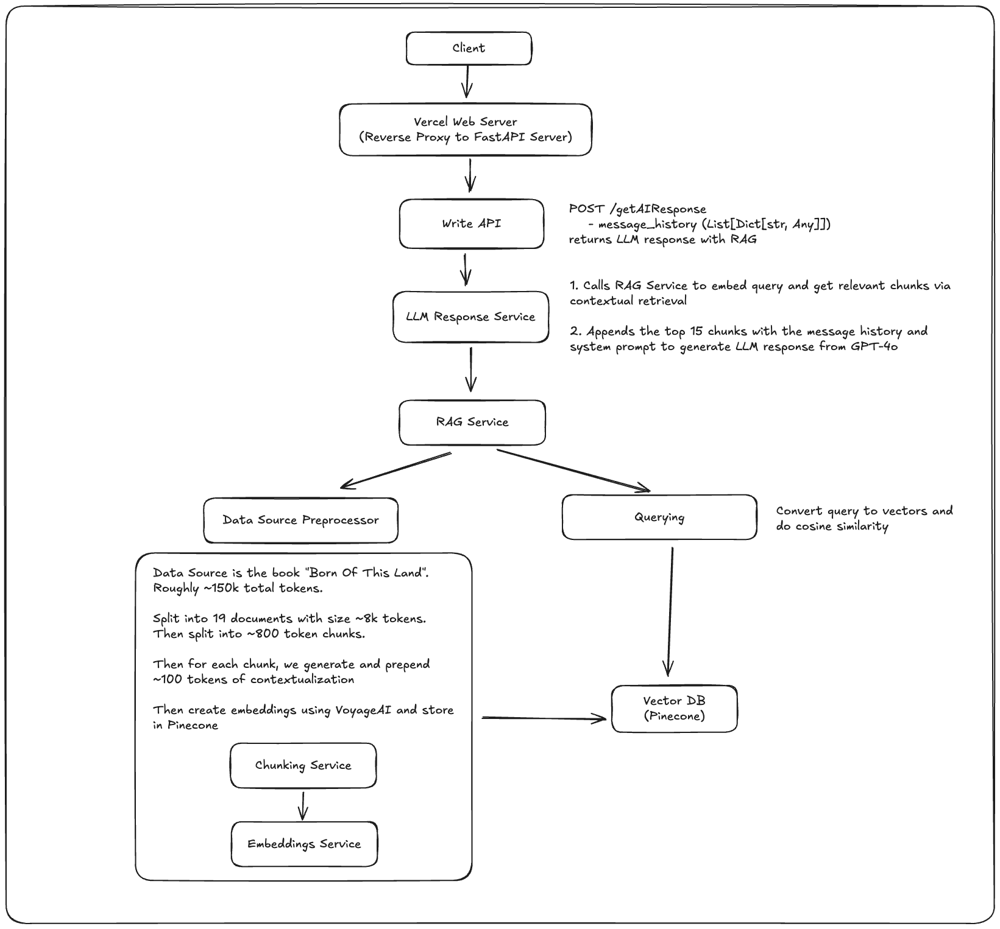

# book-llm

### About

_BookLLM_ is an extraordinary answer engine that brings books to life! Step into the pages of _Born of This Land_, the remarkable autobiography of Chung Ju-yung. From humble beginnings where he survived on tree bark, to building the industrial giant Hyundai, his inspiring journey is filled with wisdom and captivating stories. Experience his incredible tale firsthand at https://book-llm.vercel.app/

All answer engine responses use RAG on his ~380 page book ([download PDF here](https://oceanofpdf.com/authors/chung-ju-yung/pdf-born-of-this-land-my-life-story-download/)) to grab relevant chunks of information. You can also look at my [Figma designs here](https://www.figma.com/design/0ky9243WnNQmxIliAhE9hO/Perplexity-Take-Home?node-id=0-1&t=XThwfLl6yEyxDa8n-1) or my [prep notes here](https://useful-gerbil-987.notion.site/Perplexity-Take-Home-170bfb58abc48008a791db136888582d?pvs=4)

### Demo

Watch a quick demo of the app here: [Demo Video](https://drive.google.com/file/d/1tU4DZG4T2y9028hipna3hcrcOuEJOhTW/view?usp=sharing)

### Unique Features

**Threads** 🧵

While having a conversation with an LLM, sometimes you want to ask more specific questions about a particular response. Normally, you'd have to send a new message and this could easily clutter the original conversation (and lead to unnecessary context for the LLM to base its future responses on).

With threads, you can create a separate thread on any AI response to ask more questions without polluting the original conversation flow!

**Quick Panel** ⚡

There are many times where parts of an LLM answer don't quite make sense or are too general. Normally, you'd have to copy/paste the response bit and then type out a whole "explain more" or "simplify this please". The Quick Panel provides one click shortcuts to save you time!

**Artificial Throttling** ⏱️
Since LLM response times have gotten super fast, generated responses could easily overload the user. To account for this, I've artificially throttled the responses (via a buffer and setInterval) to make the generated text extremely smooth

**Contextual Retrieval** 📚
Each chunk of text retrieved from the book for RAG is enriched with valuable context - including page numbers, chapter titles, and surrounding context. Otherwise, with standard RAG, a chunk alone may be out of place and would be difficult for the LLM to understand.

### Architecture

